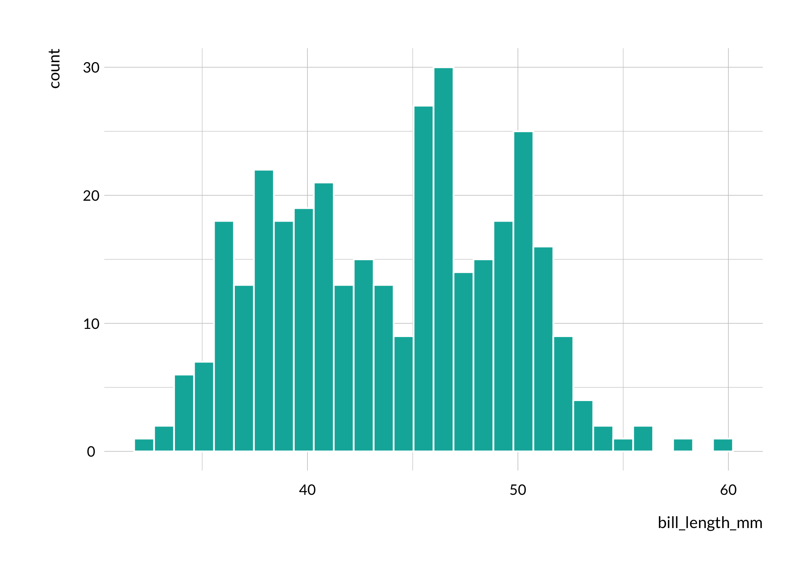
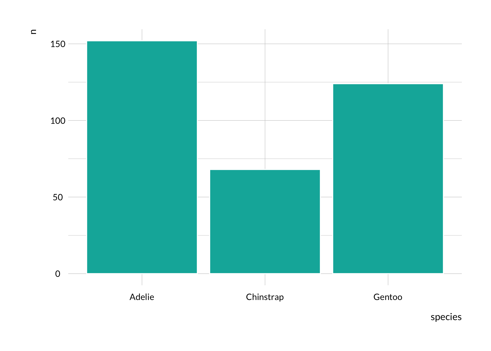
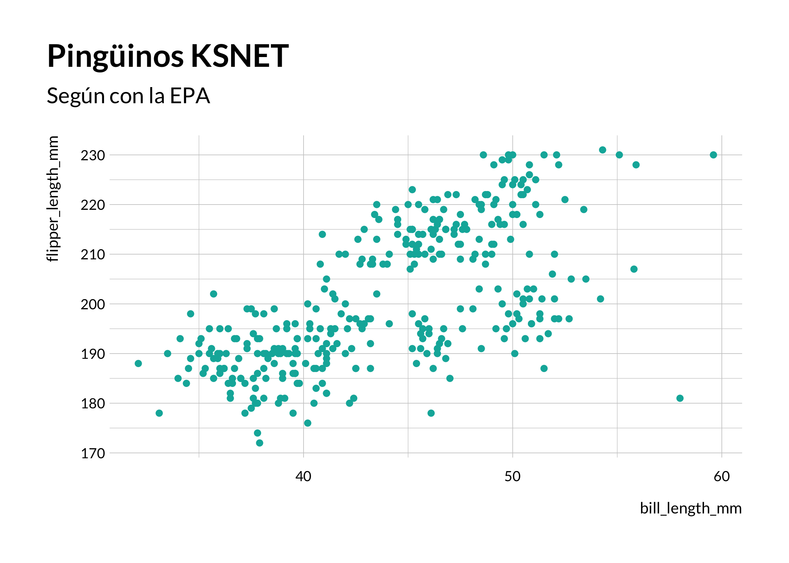
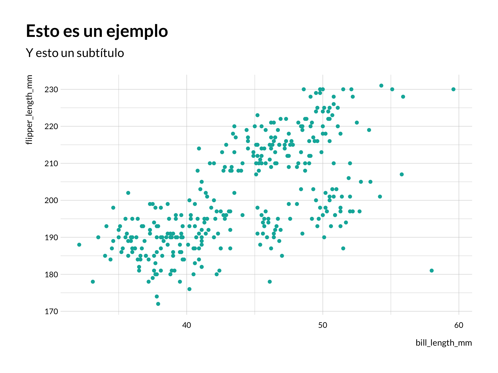
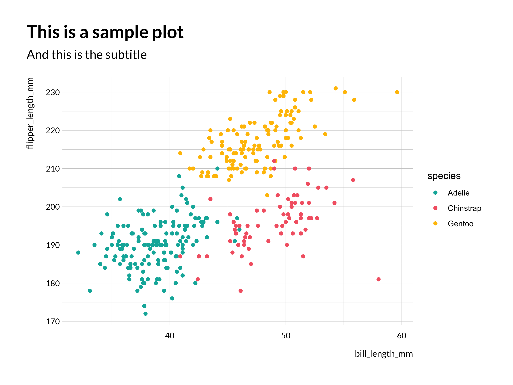
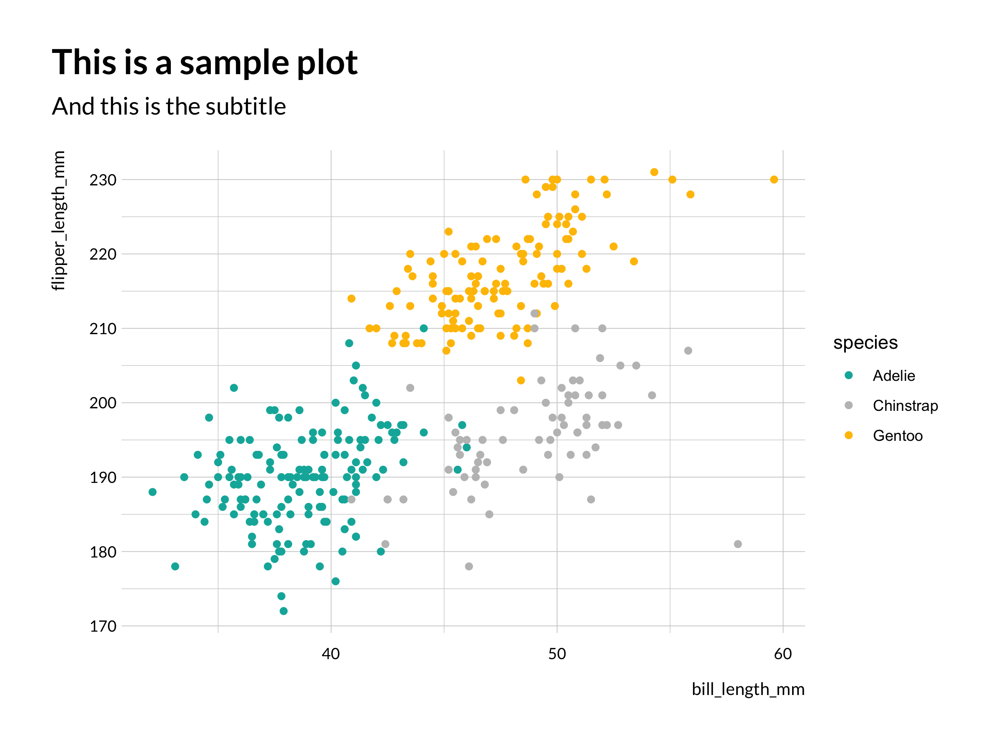

<!-- README.md is generated from README.Rmd. Please edit that file -->

# ksnet

<!-- badges: start -->
<!-- badges: end -->

El objetivo del paquete `ksnet` es simplificar las rutinas de trabajo
analítico de KSNET. El objetivo es incluir elementos como:

-   Gráficos sencillos para análisis exploratorio de datos usando
    `ggplot2`
-   Funciones auxiliares para la limpieza y análisis de datos
-   Plantillas para presentaciones, informes y resúmenes ejecutivos
-   Plantillas para gráficas
-   Funciones para ayudar a exportar datos y resultados en formatos
    accesibles
-   etcétera

## Instalación

Se puede instalar la versión en desarrollo desde
[GitHub](https://github.com/) con:

``` r
# install.packages("devtools")
devtools::install_github("octmedina/ksnet")
```

## Gráficos

Este es un ejemplo básico que muestra cómo resolver un problema común:
hacer una gráfica con datos. Empecemos con un histograma.

``` r
library(ksnet)
library(palmerpenguins)
library(ggplot2)

## Plotting a histogram of penguin bill length

ksnet_hist(penguins, bill_length_mm) 
#> `stat_bin()` using `bins = 30`. Pick better value with `binwidth`.
#> Warning: Removed 2 rows containing non-finite values (stat_bin).
```



La función se puede usar con la pipe también. Aquí hay una gráfica de
barra.

``` r
library(dplyr)
#> 
#> Attaching package: 'dplyr'
#> The following objects are masked from 'package:stats':
#> 
#>     filter, lag
#> The following objects are masked from 'package:base':
#> 
#>     intersect, setdiff, setequal, union

## Simple barplot
penguins %>%
    group_by(species) %>%
    count() %>%
    ksnet_bar(species, n) 
```



Y finalmente, scatterplots. La función viene preparada para incluir el
color estándar de KSNET, así como la plantilla de gráficos. El objeto
que genera es un `ggplot`, así que se pueden añadir títulos y etiquetas
fácilmente:

``` r
## Simple scatterplot
penguins %>%
    ksnet_scatter(bill_length_mm, flipper_length_mm) +
    labs(title = "Pingüinos KSNET",
         subtitle = "Según con la EPA")
#> Warning: Removed 2 rows containing missing values (geom_point).
```



## Themes

También podemos utilizar `themes`, o plantillas de gráficas.

``` r
ksnet_scatter(penguins, bill_length_mm, flipper_length_mm) + 
  labs(title = "Esto es un ejemplo",
       subtitle = "Y esto un subtítulo") +
  theme_ksnet()
#> Warning: Removed 2 rows containing missing values (geom_point).
```



## Paletas de colores

Por último, hemos creado paletas de colores. Por ahora hay una:
`ksnet_classic`. Para visualizarla, basta con utilizar la función
`color_ksnet`.

``` r
color_ksnet("ksnet_classic")
#> Warning: `guides(<scale> = FALSE)` is deprecated. Please use `guides(<scale> =
#> "none")` instead.
```


Este es el aspecto que tiene cuando lo combinamos con una gráfica.

``` r
penguins %>%
    group_by(species) %>%
    count() %>%
    ggplot(aes(species, n, fill = species)) + 
  geom_col() +
  labs(title = "Pingüinos una vez más",
       subtitle = "Con subtítulo") +
  theme_ksnet() +
  scale_fill_manual(values = color_ksnet("ksnet_classic"))
```



``` r
ggplot(penguins, aes(bill_length_mm, flipper_length_mm, color = species)) + 
  geom_point() +
  labs(title = "This is a sample plot",
       subtitle = "And this is the subtitle") +
  theme_ksnet() +
  scale_color_manual(values = color_ksnet("ksnet_classic"))
#> Warning: Removed 2 rows containing missing values (geom_point).
```


